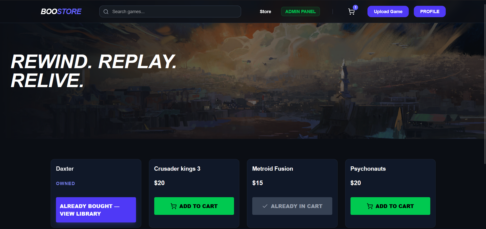
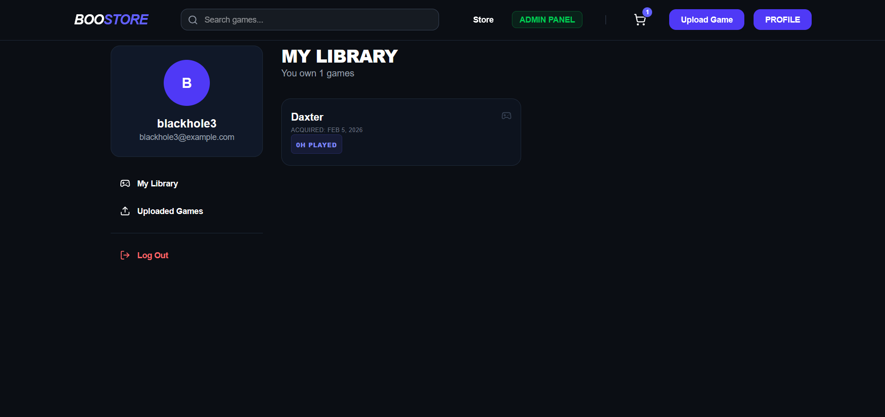
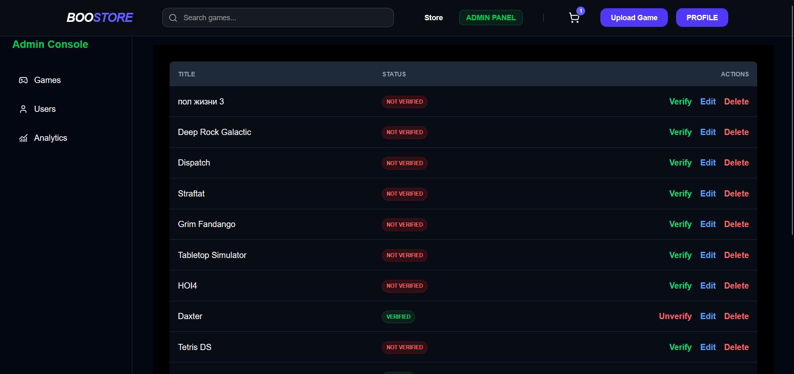

## Software Store project
### How to run project
```
go mod tidy
cd cmd/boostore
go run .
```
### Features

1. Browse available software
2. Add to cart / manage purchase
3. Admin dashboard

### Technology stack

**Frontend**: Next.js (React)
**Backend**: Gin (Go)
**Database**: MongoDB
**Other**: REST API

### Requirments

Before you begin make sure you have:

Enviromental variables
MONGO_URI=[YOUR_URI]

### Example
Main page


Profile page


Admin Page
